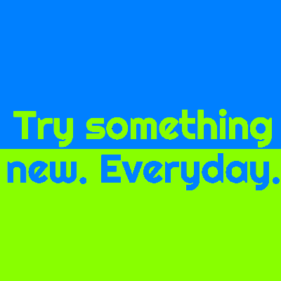

[  Try something new. Everyday.](http://blog.csaladen.es/)
======
  
  
__Try something new. Everyday.__ is my foray into data blogging and it is edited on a voluntary basis in my freetime. I try to work on data visualizations  data analyses and data mining and processing tools and methods for contemporary topics revolving around the following pillars:

- energy & politics
- development
- datactivism
- fun, cool toy visualizations
- global visualization interfaces (_exploratoriums_)
- data manipulation mechanics
- my current research work & frustrations (and rarely content) in academia

The blog’s _motto_ is __Science. Development. Datactivism. And everything in between.__

There are a lot of great data visualization blogs out there, some concentrate on the visualization code, others on aesthetics and a lot of them are just for fun. What I’m hoping that it will set Try something new. Everyday. apart form these is that with my visualizations, I strive to create a story with and about the data, but at the same time include a little bit of all of the previous attributes – pay attention that the data I am presenting is scientifically correct, it can be replicated and it looks beautiful. I deal with a variety of topics, but most are linked in some way or another to sustainability and/or development. Most of the times I will try to highlight one particular angle or insight that hasn’t come to surface yet about the studied dataset, and trying to encourage people to look at the data before they believe or act upon something – and when they do look at the data, look behind the front page, try to understand it’s structure and dynamics – and then think again. And in the end I call all of this datactivism.

All of the blog entries, infographics and data visulizations are protected by Creative Commons 3.0 license. Under these terms, feel free to write summaries and embed static images on your site, with credit attribution (Denes Csala, Try something new. Everyday. blog) and a live link to the original post. Please contact me before embedding any of the full text or interactive visualizations.

If you like what you are seeing, please like and share on social media and subscribe to (Follow in WordPress) my blog. If you really like it, please consider a small [donation](https://www.paypal.com/cgi-bin/webscr?cmd=_s-xclick&hosted_button_id=WHZW4MBHP45KS). I wholeheartedly thank all of you in advance and stay updated for data visualizations, analyses, mining and manipulation methods and infographics to your delight!

# Blog
Visit: http://blog.csaladen.es  

# Description 
https://csaladenes.wordpress.com/about/
   
# Credit
Dénes Csala, 2014  
http://csaladen.es
